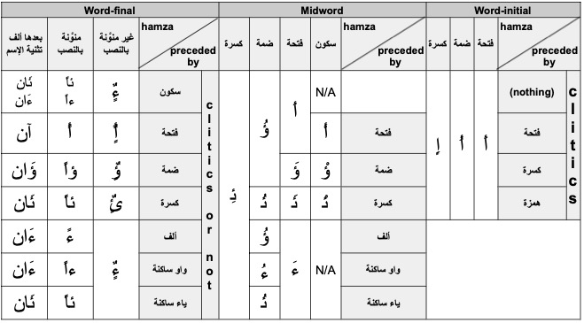

<!-- expandable: -->
<!-- 
??? optional-class "{{ more }}"
 abc -->

<!--TODO: Add special font fro CAPHI -->

# CODA\*: Conventional Orthography for Dialectal Arabic 

## CODA\* Mission

* Dialectal Arabic (DA) refers to the day-to-day vernaculars spoken in the Arab world. DA lives side-by-side with the official language, Modern Standard Arabic (MSA). DA differs from MSA on all levels of linguistic representation, from phonology and morphology to lexicon and syntax. Unlike MSA, DA has no standard orthography since there are no Arabic dialect academies, nor is there a large edited body of dialectal literature that follows the same spelling standard.
* CODA\* (pronounced CODA Star, as in, for any dialect) is a conventional orthography for dialectal Arabic. It is designed primarily for the purpose of developing computational models of Arabic dialects.

## CODA\* Goals & Intentions

* **CGI-1** CODA\* is an internally consistent and coherent convention for writing DA.
* **CGI-2** CODA\* is created for computational purposes.
* **CGI-3** CODA\* uses the Arabic script.
* **CGI-4** CODA\* is a unified framework for writing all DAs.
* **CGI-5** CODA\* aims to strike an optimal balance by maintaining a level of dialectal uniqueness yet establish conventions based on MSA-DA similarities.
* **CGI-6** CODA\* strives to be easily learnable and readable.

## CODA Design Principles

* **CDP-1** CODA\* is an ad hoc convention. There are numerous decisions that could have been made differently especially when it comes to the phonology/orthography interface. These principles make CODA\* comparable to English spelling (a bit phonological, a bit historical, with some exceptions). In some cases, we followed decisions that have been made by previously published efforts.
* **CDP-2** CODA\* uses only the inventory of Arabic script characters including the diacritics used for writing MSA. CODA\* does not use extended Arabic characters, e.g. from Persian or Urdu. CODA\* can be written undiacritized or diacritized.
* **CDP-3** Each DA word has a unique orthographic form in CODA that represents its phonology, morphology, and lexical semantics [meaning].
* **CDP-4** As a general rule, CODA\* uses MSA-like orthographic decisions (rules, exceptions and ad hoc choices), e.g., cliticizing single letter particles, using Shadda for phonological gemination, using Ta-Marbuta, Alif Maqsura, silent Alif in Waw-Alif of plurality, and spelling the definite article Al morphemically.
* **CDP-5** CODA\* generally preserves the phonological form of dialectal words given the unique phonological rules of each dialect (e.g., vowel shortening), and the limitations of Arabic script (e.g., using a diacritic and a glide consonant to write a long vowel). Two important ad hoc exceptions pertain to specific root radical letters that happen to be highly variant across dialects, e.g. ق، ث، ذ، ظ، ج , etc. and to long pattern vowels that can be shortened deterministically in the dialects, e.g., the pattern 1awA2iy3 فواعيل. For these cases, the word is written using the MSA cognate root radicals or pattern.
* **CDP-6** CODA\* preserves dialectal morphology (e.g., dialectal clitics حتقول instead of ستقول). The only exception here is separating the negation and indirect object pronouns although they are part of the word: e.g. (Cairo): ما قلت لهاش /m a # 2 u l t # i l h aa sh/ ‘I did not tell her’.
* **CDP-7** CODA\* preserves dialectal syntax, i.e. there is no change in word order.
* **CDP-8** CODA\* aims to be easy to learn and write, encouraging high inter-annotator agreement; the more CODA\* looks like what a dialect speaker may write, the better.
* **CDP-9** CODA\* rules are dialect independent. (note that dialect-specific exception lists from previous CODA versions have been redesigned and unified into dialect independent sets of specific rules).
* **CDP-10** CODA\* specific rules override general rules and apply to certain pre-defined classes of words – roughly corresponding to closed class or highly marking frequent words. The aim is to preserve important morphological information, maintain dialect integrity, and ensure overall readability.

## CODA\* Rules

### Introduction

CODA\* (pronounced CODA Star, as in, for any dialect) is a conventional orthography for dialectal Arabic. It is designed primarily for the purpose of developing computational models of Arabic dialects. See CODA\* Main Page for a description of CODA\* mission statement and design guidelines.

Some sections of these guidelines are continuously researched and updated as more dialectal data is incorporated.

(CODA\* version: 0.43)
 
### Basic Terminology

#### Sounds – Letters – Diacritics
<!--TODO: Add link to phonology refeference-->
The term **sounds** is used in the context of *pronunciation* (**phonology**), while **letters** and **diacritics** are used in the context of *writing* (**orthography**). Sounds can be **consonants** or **vowels**, and they are represented using the CAPHI representation (see Phonology Reference) and are bounded by forward slashes when necessary. Letters and diacritics are symbols used in the Arabic script to write words. Letters in the Arabic language are always required to be written; while diacritics are optional.

The space for consonants and vowels is shared by letters and diacritics, neither of which is exclusive to either category of symbols. To understand this shared space, keep in mind the following:

***

*Letters* can be used to write:

* *consonants*, for example:
 * /b/ written "ب", e.g., /b aa b/, باب, 'door'
 * /y/ written "ي", e.g., /y i k t u b/, يكتب, 'he writes'
* *vowels*, for example:
 * /i/, written "ي", e.g., /k i t aa b i/, كتابي, 'my book'

***

*Diacritics* can be used to specify:

* *no vowel*, for example:
 * " ْ " /Ø/ (سكون), e.g., /k a l b/, كلْب, 'dog'
* *double consonants*, for example:
 * " ّ " /x x/ (شدّة), e.g., /k a s s a r/, كسّر, 'he broke'
* *vowels*, for example:
 * “ َ ” /a/ (فتحة), e.g., /k a t a b/, كَتَب, 'he wrote'
* *vowels+consonants*
 * “ ً ” /a n/ (تنوين or nunation), e.g., /f i 3 l a n/, فعلاً, 'verily'

<!-- #### Basic Terminology -->

#### Roots – Patterns

Arabic’s **templatic morphology** makes common reference to the concept of the **root**, a typically tri-consonantal abstraction capturing a general meaning about the word. For example, the root ك•ت•ب 'writing-related' appears in words like مكتب 'office' and كتاب 'book'. Each sound in the root is referred to as a **radical**. The general complement of the root is the **pattern**, which in the examples above are *ma12a3* and *1i2A3* where *1*, *2*, and *3* are slots for the root radicals. In addition to the root and pattern *templatic morphemes*, Arabic uses numerous other *concatenative morphemes* (see next section).

<!-- #### Basic Terminology -->

#### Base Words – Clitics – Words

**Base words** in Arabic are defined to consist of a **stem** and the minimal number of *concatenative **affixes*** needed to specify the obligatory features for its **part-of-speech** (**POS**). A stem can be *non-templatic* or it can be composed from the interdigitation of a root and a pattern. Note that the pattern may also specify the features fully without the need for affixes such as in broken plurals. Base words are as such the smallest fully formed words. Examples include: كتابين 'two books' and يكتبون 'they write'.

**Clitics** are syntactically independent but phonologically dependent morphemes that are attached to the word phonologically, e.g., وذهب /w a # dh a h a b a/ 'and he left'

**Words** can be base words or base words with added clitics. We use the term word to refer to the phonological utterance or the orthographic string, and we specify as needed. In CODA, *phonological words* typically map one-to-one to *orthographic words*; but there are many exceptions, pertaining mostly to clitics that are spelled as separate orthographic words.



***

??? optional-class "Click to see another example"
 

#### Cognates

Dialectal words will often sound similar to homologous words in MSA. An *etymology* can very often be traced between both. When this is the case, then we can say that the dialectal word has **cognate** in MSA. We specify some heuristic rules below to categorize cognate relationships into two types: **direct** and **indirect** cognates.

The **direct cognate** and corresponding dialect word must meet the below specifications (see examples in the table below):

<!-- TODO: Add link to morphology section-->
<!-- TODO: Add exception clause سئيل-->
<!-- TODO: Add exception clause مظبوط-->
<!-- TODO: Add مبارح example-->
1. The two words are determined (following a linguistic process) to originate from the same root radicals (wether pronounced the same way or not) or to share a subset/superset of root radicals. To some extent, they should also share the same pattern. If they do not but still have the same meaning, then there is said to be *heavy cognate divergence*.
2. The dialect word and MSA word mean the same thing *in context* (same POS and obligatory features; see Morphology section).
3. The dialect word and its meaning *in context* do not exist together in MSA.

| CODA | Dialect CAPHI | Gloss | Root | MSA Cognate | MSA CAPHI | Dialect | Comments |
|-|-|-|-|-|-|-|-|
| جاج | j aa j | chicken | د•ج•ج | دجاج | d a dj aa dj | ?? | First radical missing in dialectal word. See (1) of direct cognate.|
| نصّ | n o s. s. | half | ن•ص•ف | نصف | n u s. f | ?? | First radical missing in dialectal word and substituted by gemination. See (1) of direct cognate.
| ولاد | w l ee d | kids | و•ل•د | أولاد | 2 a w l aa d | ?? | No radical missing, but the the first letter in the broken plural pattern أفعال is missing. See (1) of direct cognate.
| قلم | 2 a l a m | pen | ق•ل•م | قلم | q a l a m | ?? | See (1) of direct cognate. |
| ألم | 2 a l a m | pain | ء•ل•م | ألم | 2 a l a m | ?? | See (1) of direct cognate. |
| روح | r uu 7 | go [2s command] | ر•و•ح | رُح | r u 7 | ?? | See (2) of direct cognate. |
| شغل | sh i gh i l | work [noun] | ش•غ•ل | شُغْل | sh u gh l | ?? | The cognate is not عمل (MSA) because شغل exists in MSA with same meaning. See (3) of direct cognate. |
| مرا | m a r aa | woman | م•ر•ء | امرأةٌ | 2 i m r 2 t u n | ?? | We can hypothesize with a fair degree of certainty that both words come from the same root but not from the same pattern. This is a case of heavy cognate divergence. See (1) of direct cognate.|
| جوز | j oo z | spouse | ز•و•ج | زوج | z a w dj | ?? | This is a case of metathesis in which two sounds are transposed. The root and pattern are still maintained, so the cognate relationship is preserved. See (1) of direct cognate.|

 

The **indirect cognate** and corresponding dialect word must meet the below specifications (see indirect cognate examples in the table below):

1. The two words share the same root.
2. The two words share a similar pattern

| CODA | Dialect CAPHI | Gloss | Root | MSA Cognate | MSA CAPHI | Dialect | Comments |
|-|-|-|-|-|-|-|-|
| قمّور/أمّور  | 2 a m m uu r | darling | ق•م•ر/أ•م•ر  | N/A | N/A | ?? | It could not be determined whether this word is a templatic diminutive of أمير 'prince' or قمر 'moon' and in any case the first radical is pronounced dialectally as /2/. See indirect cognate. |
| وليدة | w l ii d a | girl | و•ل•د  | N/A | N/A | Tunis | It is obvious that the word comes from the root و•ل•د and even has the pattern فعيل. No word in MSA with the same root/pattern shares the same meaning.|

 

The difference between a direct and indirect cognate relationship is that whereas in the former, an actual MSA word is assigned to the dialectal word, the latter only has a root associated to it.

 

### CODAfication Process

Lay out a method to get a CODA word.
Discuss separating etymology/morphology from CODAfication process

### General Rules (GR) – Basic Phonology to Orthography Mapping

In this section, rules will be specified and examples will be given based on different phenomena that will require an analysis of word phonology, morphology, and etymology to generate the corresponding CODA spelling.

#### Vowel Length Rules

In many dialects, base word vowel length may differ between the corresponding MSA and dialect word in different contexts (e.g., inflections, clitic attachment) for the same word. Long vowels are generally spelled using the three letters " ا " /aa, aa./, " ي " /ii, ee/, and " و " /uu, oo/. Short vowels /a, i, u, o, e/ are spelled using diacritics. The following rules dictate when one should be used over the other when a mismatch exists between the dialectal phonology and the MSA cognate spelling (which generally matches the phonology).

***

**GR-Prefer-Long-Vowel** If the vowel length differs between a dialect word and its MSA cognate (within the base word), then generally, so long as the vowel is the same quality as in MSA, the rule is to prefer the long letter-based spelling over the shortened diacritic spelling to preserve the dialectal phonology (based on **CDP-5**).

***

| CODA | CAPHI | Gloss | MSA Cognate | Dialect | Rules Invoked | Comments |
|-|-|-|-|-|-| - |
| قانون | 2 a n uu n | law | قانون | Cairo | **GR-Prefer-Long-Vowel** | Dialectal templatic vowel shortening |
| قولوا له | 2 u l uu # l u | tell him [2p] | قولوا له | Cairo | **GR-Prefer-Long-Vowel** | Context dialectal vowel shortening: قول is pronounced with a short vowel here due to the attachment of the له clitic |
| روح | r uu 7 | go [2p] | رُح | Beirut | **GR-Prefer-Long-Vowel** | Context dialectal vowel elongation: روح is pronounced with a long vowel as opposed to its MSA cognate |
| كاتبين | k a t b ii n | [they are] writing | كاتبين | Cairo | **GR-Prefer-Long-Vowel** | Context dialectal vowel shortening: the " ا " in كاتبين is pronounced with a short vowel /a/ as opposed to its MSA cognate due to the affixation of ين (plural inflection). |

<!--TODO: Add rmaat and kuura examples from TUN after discussion with Nizar-->
<!--TODO: Add some EGY examples w a 7 sh ii n n a-->

***

#### Hamza Rules

*Hamza* (همزة; glottal stop) spelling follows from the same rules as those of MSA and is unchanged from previous CODA versions. For a guide on hamza spelling in all positions (*word-initial*, *mid-word*, and *word-final*), refer to the below table. The following are the rules applying to the all kinds of hamzas. By *word*, what is meant is the base word and attaching attaching clitics (see [Base Words – Clitics – Words](#base-words--clitics--words)).

***

**GR-Hamza-Spelling** Disconnecting hamza rules are dictated by the below MSA rules.

<!--TODO: These are the same as MSA rules except that in CODA (as specified in the table), clitic attachment should not affect hamza spelling.-->

  

***Notes on table:***

* When there are two cases within the same cell, the first case specifies what to do if the preceding letter is a connecting letter (e.g., "ب", "ل", "س", "ط") and the second in the case of a preceding disconnecting letter (e.g., "د", "ز", "و", "ر").
* Proclitic and enclitic are meant to specify cases when clitics attach to either end of the base word when it either starts or ends with a hamza. These generally do not affect the spelling of the hamza.
* واو/ياء ساكنة : unambiguously refers to when the " ي " is pronounced as /y/ or /ii, ee/, and when the " و " is pronounced as /w/ or /uu, oo/.

<!-- TODO: move two rules below to exceptions (specific rules)-->
***

**GR-Hamza-Ambiguous-Spelling** If a dialectal word matches its MSA cognate phonologically except for the vowels, and the dialectal vowels would cause the MSA hamza spelling to change, then the latter should be preferred.

***

**GR-Word-Initial-Hamza-Affixation** If a hamza-initial dialectal word does not have an MSA cognate but fits in an MSA pattern paradigm, then even affixation (in addition to clitic attachment) should not affect its spelling.

***

The *Hamzat-Wasl* (همزة وصل or connecting hamza) can be differentiated from the disconnecting hamza (همزة قطع) in that if a clitic is added before a hamza-initial word, then the Hamzat-Wasl is not pronounced whereas the regular one is (as a glottal stop). The Hamzat-Wasl is only pronounced when there is no previous utterance to connect it to and only appears in the beginning of a word. Writing it is dictated by the following rule.

***

**GR-Hamzat-Wasl** The Hamzat-Wasl is used only in the following cases word-initally:

* with tri-literal root command verbs that require a hamza in the beginning
* with افتعل and استفعل pattern verbs
* with some nouns such as اسم، ابن، امرؤ، امرأة
* with Al-Taarif (ال التعريف)

In virtually all other cases, one of the forms of the disconnecting hamza is used as dictated by the **GR-Hamza-Spelling** rule.

***

**GR-Word-Initial-Hamza-Optional** Both connecting and disconnecting hamzas may be omitted word-initially.

***

The *Hamzat-Madd* (همزة المد) comes (analytically) from a hamza on an Alif followed by an Alif (" أَ + ا "). The below rule applies to the Hamzat-Madd.

***

**GR-Hamzat-Madd** Hamzat-Madd (همزة المد) must be used in the following scenarios:

* in first person imperfective hamza-initial verbs if it is actually pronounced as /2 aa/
* in general, whenever the correct hamza form to use is the hamza on an Alif (أ) and the sound /2 aa/ should be represented

***

**GR-Hamza-Spell-Sound-Match** Hamza spelling matches the sound. In other words, dialectal words that have MSA cognates containing a hamza but do not contain a /2/ sound in their phonology are spelled without the hamza.

| CODA | CAPHI | Gloss | MSA Cognate | Dialect | Rules Invoked | Non-CODA Examples | Comments
| - | - | - | - | - | - | - | - |
| الف | 2 a l f | thousand | ألف | Sanaa | **GR-Word-Initial-Hamza-Optional** |
| مألوف | m a 2 l uu f | familiar | مألوف | Sanaa | **GR-Hamza-Spelling** |
| لا مؤاخذة | l a # m u 2 a kh z a | excuse me | لا مؤاخذة | Cairo | **GR-Hamza-Spelling** |
| فئة | f i 2 e | denomination | فئة | Sanaa | **GR-Hamza-Spelling** |
| يأنتر | y i 2 a n t i r | he is using the internet | يستعمل الإنترنت | Sanaa | **GR-Word-Initial-Hamza-Affixation** | يِئنتر | Following the hamza rules, this should have been spelled يِئنتر because of the كسرة preceding the hamza.|
| بريء | b a r ii 2 | innocent | بريء | Sanaa | **GR-Hamza-Spelling** |
| بير | b ii r | well | بئر | Sanaa | **GR-Hamza-Spell-Sound-Match** |
| سما | s a m e | sky | سماء | Sanaa | **GR-Hamza-Spell-Sound-Match**, **GR-Prefer-Long-Vowel** |
| ما | m aa | water | ماء | ِAlgiers | **GR-Hamza-Spell-Sound-Match**, **GR-Prefer-Long-Vowel** |
| آسف | 2 aa s i f | sorry | آسف | Sanaa | **GR-Hamzat-Madd** | اسف |
| تأمين | t e 2 m ii n | insurance | تأمين | Beirut | **GR-Hamza-Ambiguous-Spelling** | تئمين
| مؤرّخ | m 2 a r r i kh | historian | تأمين | Jerusalem | **GR-Hamza-Ambiguous-Spelling** | مأرّخ | Following the hamza rules, this should have been spelled مأرّخ because of the سكون preceding the hamza.
| انطور | n t. oo r | wait [2ms command] | انطر | Beirut | **GR-Hamzat-Wasl**, **GR-Prefer-Long-Vowel** | نطور، انطر 
| افتراءه | 2 i f t i r aa 2 o h | his slander | افتراءه، افتراؤه | Beirut | **GR-Hamza-Spelling**, **GR-Hamzat-Wasl**, | افتراؤه | Some schools of spelling (in MSA) consider the clitic to be part of the base word, hence causing the final hamza to change form when attached to a clitic (here the direct object [3ms]); CODA doesn't.
<!--TODO: check CAPHI of example above-->

#### Diacritics

<!-- TODO: Add reference to phonology section-->
<!-- TODO: emphasize the oo and ee-->
<!-- TODO: maybe should add a reference in the general rules to all specific rules that go against them-->

While Arabic diacritics are optional in general, they can be crucial for disambiguation in certain contexts. Arabic diacritics are primarily used for representing short vowels, or absence of vowels (see the Phonology reference for a detailed mapping between letters/diacritics and sounds). However, the Shadda diacritic is used to represent consonantal gemination, e.g. كَتَّب /k a t t a b/ ‘he dictated’. As such, the Shadda interacts with the number of letters in a word.

***

<!--TODO: maybe should split into two rules-->
<!--TODO: add reference to definite article rule which overrides this rule-->
**GR-Shadda** The shadda diacritic should be used within the base word (i.e., including suffixes and prefixes but not across baseword word-clitic boundaries) whether for affixation purposes or for templatic purposes.

***
<!--TODO: Ask Nizar if examples are correct-->

| CODA | CAPHI | Gloss | Tokenized CODA | Dialect | Rules Invoked | Non-CODA Examples | Comments | 
| - | - | - | - | - | - | - | - |
| جنَّنّاهم | g a n n a n n aa h u m | we made them crazy | جنّن+نا+هم | Cairo | **GR-Shadda** | جنَّنناهم | Note that this نا is a suffix referring to the obligatory verbal features [1p] and is part of the base word. See the Morphology section for a definition of obligatory features. <!--TODO: add link-->|
| جنَّنْنا | g a n n a n n a | he/it mad us crazy | جنّن+نا | Cairo | **GR-Shadda** | جنَّنّا | The نا here is a direct object and as such is an enclitic and not a suffix making it not part of the base word. Hence, the shadda should not interact with it.
| يبارككم | b aa r i k k u m | [he] congratulates you | يبارك+كم | Cairo | **GR-Shadda** |
| واحشيننا | w aa 7 sh i n n a | we miss you | واحشين+نا | Cairo | **GR-Shadda** |
| كتّب | k a t t a b | he dictated | كتّب | Cairo | **GR-Shadda** | كتب | Templatic shadda (from the template فعّل).

#### Root Radical Spelling

The dialects share the majority of their roots with MSA. Although the phonology of the derived words from a root may differ from the MSA phonology, a relatively systematic mapping can be drawn between both phonologies, and thus, to prevent the dialectal phonology from overwhelmingly overriding MSA spelling, we allow a few exceptions to **CDP-5** (phonological preservation) rule in favor of the **CDP-4** rule (MSA-similarity).

We define the **dialectal root** as the set of root radical sounds that, when interdigitated into the corresponding dialectal pattern of the dialectal word, form a phonologically faithful representation of the word, based on **CDP-5** and all the above rules (**GR-\***).

**GR-Root-Radical-Spelling** A limited number of consonants should be spelled differently from their phonology if the following two conditions are met:

1. The dialectal root must have a cognate MSA root (word has a direct or indirect cognate).
2. The dialectal radical sound(s) and the MSA radical sound(s) are paired according to the set of allowed common sound changes (pairings) outlined in the below table.

<!--TODO: make sure table is complete-->

| CODA | Dialectal Sound Variant(s) | MSA Sound | 
|------|----------------------------|-----------| 
| ت | t., d, d. | t | 
| ث | t, t., s | th | 
| ج | j, tsh, gy, y | dj, g | 
| د | t., d. | d | 
| ذ | d, dh., z | dh | 
| ر | gh | r | 
| ز | s, s. | z | 
| س | s., z | s | 
| ش | tsh | sh | 
| ص | s, z | s. | 
| ض | d, dh., z. | d. | 
| ط | t | t. | 
| ظ | d., z. | dh. | 
| ق | j, dz, dj, k, g, qh, 2 | q | 
| ك | ts, tsh, g | k | 
| ن | m | n | 

***

| CODA | CAPHI | Gloss | Dialectal Root | Cognate Root  | Dialectal Sound | MSA Sound | Dialect | Rules Invoked | Non-CODA Examples | Comments | 
| -| -| -| -| -| -| -| -| - | - | -| -|-|
| ثامن | t aa m i n | eighth | **ث**•م•ن | **ث**•م•ن | t | th | Jeddah | **GR-Root-Radical-Spelling** | تامن |
| فستان | f u s t. aa n | dress | ف•س•**ط**•ن/ن•**ص**•**ط**•ن |  ف•**س**•**ت**•ن | t. | t | Amman | **GR-Root-Radical-Spelling** | فسطان، فصطان |
| ذيل | d ee l | tail | **د**•ي•ل | **ذ**•ي•ل | d | dh | Beirut | **GR-Root-Radical-Spelling** | ديل |
| ضحك | d i 7 i k | he laughed | د•ح•ك| ض•ح•ك | d | d. | Cairo |  | دحك |
| ضفدعة | d. u f d. a 3 a | frog | ض•ف•ض•ع| ض•ف•د•ع | d. | d | Cairo |  | ضفضعة |
| ظهرية | d. u h r i y y a | shaddow | ض•ه•ر| ظ•ه•ر | d. | dh. | Jeddah |  | ضهرية |
| ذوق | dh. oo g | tasting | ز•و•ق| ذ•و•ق | dh. | dh | Baghdad |  | ظوق |
| ضغط | dh. a gh a t. | he pressed | ظ•غ•ط| ض•غ•ط | dh. | d. | Jerusalem | ظغط |
| ثورة | s a w r a | revolution | س•و•ر| ث•و•ر | s | th | Cairo | سورة |
| الزعيم | 2 a s s e 3 ii m | the boss | د•ح•ك| ض•ح•ك | s | z | Sana’a | السعيم |
| صايغ | s aa y e gh | jeweler| س•و•غ| ص•و•غ | s | s. | Cairo | سايغ |
| سلطة | s. a l. a t. a | salad | ص•ل•ط| س•ل•ط | s. | s | Khartoum | صلطة |
| ذبيحة | z a b ii 7 a | meat | ز•ب•ح| ذ•ب•ح | z | dh | Muscat | زبيحة |
| اسبوع | 2 i z b uu 3 | week | ز•ب•ع| س•ب•ع | z | s | Khartoum | ازبوع |
| صغير | z gh ii r | small | ز•غ•ر| ص•غ•ر | z | s. | Beirut | زغير |
| عظيم | 3 a z. ii m | great | ع•ز•م| ع•ظ•م | z. | dh. | Damascus | عزيم |
| طريق | t. a r ii j | road | ط•ر•ج| ط•ر•ق | j | q | Baghdad | طريج |
| سمك | s i m a ts | fish | س•م•تس| س•م•ك | ts | k | Riyadh(B) | سمتس |
| سمك | s i m a tsh | fish | س•م•تش| س•م•ك | tsh | k | Basra | سمج، سمتش |
| جزاير | dz aa y i r | Algeria | د•ز•ر| ج•ز•ر | dz | dj, g | Algiers | دزاير |
| طريق | t. a r ii dz | road | ط•ر•دز| ط•ر•ق | dz | q | Riyadh(B) | طريدز |
| طريق | t. i r ii dj | road | ط•ر•دج| ط•ر•ق | dj | q | Abu Dhabi | طريج |
| شاف | tsh aa f | he saw | تش•و•ف| ش•و•ف | tsh | sh | Doha | تشاف |
| رقم | r a k a m | number | ر•ك•م| ر•ق•م | k | q | Jerusalem(R) | ركم |
| قال | g aa l | he said | ق | g | q | Aswan | جال، كال | 
| بنك | b. a n g | bank | ك | g | k | Baghdad | بنج، بنق | 
| رقم | r a qh a m | number | ق | qh | q | Khartoum | رغم، رجم | 
| غسالة | kh a s s ee l a | washer | غ | kh | gh | Tunis | خسالة | While there is no /kh/ to غ mapping in the root radical cognate table, this switch is allowed in this particualr case because Tunisian use of /kh a s s ee l a/ and /gh a s s ee l a/ is in free variance
| اريد | 2 a gh ii d | I want | ر | gh | r | Mosul | اغيد | 
| طريق | t. a r ii 2 | road | ق | 2 | q | Damascus | طريء | 
| جنب | j a m b | besides | ن | m | n | Jeddah | جمب | 
| جلس | y a l a s | he sat down | ج | y | dj, g | Abu Dhabi | يلس | 
| عيونج | 3 y uu n i tsh | your eyes [2fs] | ج | tsh | dj, g | Doha | عيونش، عيونتس | Remember that root radicals only apply to the root of the base word, and that clitics such as the possessive pronoun ج+ may have their own rules (see specification tables)
| كتابج | k i t aa b i ts | your [2fs] book | ز•غ•ر| ص•غ•ر | ts | dj, g | Riyadh(B) | كتابتس، كتابك | Remember that root radicals only apply to the root of the base word, and that clitics such as the possessive pronoun ج+ may have their own rules (see specification tables)

 

 <!--| برتقان | b u r t u 2 aa n | orange | ق | 2 | q | Cairo |  | برتئان، برتقال | | Only the sound-letter pairs that are in the list of permitted changes are changed. The table does not specify a chagne of /n/ to " ل " so the phonology is preserved in this case.-->

 <!--| مضبوط | m a z. b uu t. | correct | ض | z. | d. | Jeddah | مزبوط | -->

<!-- Should add a rule for words which fit in patterns but do not have an MSA cognate يأنتر -->

#### Miscellaneous Rules

##### Pattern Spelling

Dialectal words with patterns that are cognates of MSA patterns will retain the spelling choice of the MSA pattern if the difference in pronunciation can be expressed using diacritics (for vowel change or vowel absence), or if the pronunciation is a shortened form of the MSA pattern vowels.

Elongated vowels and initial vowels in otherwise cognate MSA patterns will be spelled using the general rules, e.g اتدشدش below. 

Consonants in the underlying pattern are generally preserved in the final form of the word regardless of any phonetic interactions. The only exception to this rule are MSA patterns whose form changes in the standard MSA spelling, such as افتعل -- for example: ازدهر، اضطرب.

<!-- TODO: add additional examples -->

| CODA | CAPHI | Gloss | Pattern | Dialect | NON-CODA examples; Comments | 
| -| -| -| -| -| -|
| اتضرب | 2 i d. d. a r a b | he got hit | اتفعل | Cairo | ادضرب، اضّرب | 
| اتدشدش | 2 i d d a sh d a sh | he got smashed | اتفعلل | Cairo | ادّشدش |
| انضرب | n d. a r a b | he got hit | انفعل | Amman | نضرب |

<!-- #### General

##### Base Word Spelling -->

##### Alif Maqsura

The MSA rules for spelling the Alif-Maqsura (ى), which are sometimes based on roots and sometimes on patterns, apply in CODA\*.

| CODA | CAPHI | Gloss | Dialect | NON-CODA examples; Comments | 
| -| -| -| -| -| 
| اعطى | 2 a 3 t. a | give [3ms] | Abu Dhabi | اعطا | 
| بغى | b gh a | want [3ms] | Rabat | بغا | 
| حكى | 7 a k e | chat [3ms] | Beirut | حكي | 

***

**GR-Clitic-Spelling** Clitics that are mapped into single letters (with possible diacritics) will be spelled attached to the word, and will not interact with the spelling of the word. For examples of specifc rules that override this rule, see "The Definite Article" and "Nominative Pronouns".

| CODA | CAPHI | Gloss | Tokenized CODA | Dialect | Comments | 
| -| -| -| -| -| -| 
| ولحد ما يجي | w l a 7 a d d #  m a # y ii g i | and until he/it comes | و+ل+حد ما يجي | Cairo | notice how و and ل (single letter clitics) attach   to adjacent morphemes while ما does not. | 

## Specific Rules

***

**SR-Definite-Article** The Arabic definite article is always written as a proclitic ال+ـ, regardless of how it is pronounced (keep in mind that in DA, lunar/solar letters are not always the same as in MSA). As with MSA spelling, general cliticization rules apply except when following the proclitic ل+ـ, where the article is spelled without its ا. The general Shadda rule is overridden in the specific context of ل+ ال+ـ followed by an ل-initial base word.

| CODA | CAPHI | Gloss | Tokenized CODA | Dialect | Comments | 
|-|-------|-|-|-|-| 
| القمر | 2 i l 2 a m a r | the moon | ال+قمر | Cairo | | 
| الشمس | 2 i sh sh a m e s | the sun | ال+شمس | Jerusalem | | 
| الكتاب | 2 i k k i t aa b | the book | ال+كتاب | Cairo | Note how Cairene sometimes treats /k/ as a solar letter | 
| البيت | l b ee t | the house | ال+بيت | Jerusalem | | 
| البيوت | l e b y uu t | the houses | ال+بيوت | Jerusalem | | 
| بالبيت | b e l b ee t | at home | ب+ال+بيت | Jerusalem | | 
| بالبيوت | b l e b y uu t | at the houses | ب+ال+بيوت | Jerusalem | | 
| للبيت | l a l b ee t | for the house | ل+ال+بيت | Jerusalem | | 
| للبيوت | l a l e b y uu t | for the houses | ل+ال+بيوت | Jerusalem | | 
| للشمس | l a sh sh a m e s | to the sun | ل+ال+شمس | Jerusalem | | 
| للشموس | l a l e sh m uu s | to the suns | ل+ال+شومس | Jerusalem | | 
| اللجنة | 2 e l l a g n a | the committee | ال+لجنة | Cairo | | 
| للجنة | l e l l a g n a | for the committee | ل+ال+لجنة | Cairo | Note how it is not spelled لللجنة and the general shadda rules are   overriden (see general "Diacritics" rules). | 

***

The Ta-Marbuta (ة) is a secondary letter of the Arabic alphabet used to represent a particular suffix morpheme that is often (but not exclusively) associated with the feminine-singular feature (Alkuhlani and Habash, 2011). This morpheme has a number of allomorphs with differing pronunciations. Most notably, it appears as a vowel at the end of nominals, and changes to a ∼ /t/ when followed by possessive pronominal enclitics. <!--TODO: add comment here about the ambiguity in pattern and function-->

***

**SR-Ta-Marbuta** The Ta-Marbuta should be written as ة in word-final positions, regardless of its pronunciation, and following general CODA rules in non-word-final positions (i.e., when an enclitic is present).

| CODA | CAPHI | Gloss | Dialect | Comments |
|------------------------------------|----------------------------------------------------------|---------------------|-------------| - |
| حاجة | 7 aa g a | something | Cairo | 
| حاجتي | 7 aa g t i  | my thing | Cairo | 
| حاجتها | 7 aa g i t h a | her thing | Cairo | 
| طاولة | t. aa w l e | table | Jerusalem | 
| غزالة | gh a z ee l i | gazelle | Beirut | 
| معلمة مدرسة | m 3 a l m i t # m a d r a s e | school teacher | Jerusalem | 
| معلمة مدرسة | m 3 a l m e # m a d r a s e | she taught a school | Jerusalem | <!--TODO: add comment here about the ambiguity in pattern and function-->|
| معلمتهم | m 3 a l m i t h u m | their teacher | Jerusalem | 
| معلماهم | m 3 a l m aa h u m | she taught them | Jerusalem | 

<!-- #### Specific Rules -->

### The Plural Waw

Verbal suffixes that indicate the feature plural subject [2p] & [3p] and end with the sounds (/u/, /uu/, /o/, /oo/, and /aw/) will represent those sounds as وا+ (‘Waw of Plurality’ واو الجماعة) in word-final positions, and also when followed by other attached clitics. This rule is similar to the MSA rule, except for expanding the phonetic definition.

| CODA | CAPHI | Gloss | Dialect | 
|---------------------------------|----------------------------------------------|------------------|-------------| 
| قالوا | 2 aa l u | they said | Cairo | 
| بيقولوا | b i y 2 uu l u | they say | Cairo | 
| نقولوا | n q uu l u | we say | Tunis | 
| قالوا | g aa l a w | they said | Abu Dhabi | 
| قالوها | 2 a l uu h a | they said it | Cairo | 
| ما قالوش | m a # 2 a l uu sh | they did not say | Cairo | 
| قالوا له | 2 a l uu # l u | they said to him | Cairo | 

 

<!-- #### Specific Rules -->

### Negation Clitics

The negation particle (/m a/, /m aa/) has phonologically become a proclitic in many dialects. However, it is always written as a separate particle ما except when overridden by other specification rules. One example of such a rule is the case of negated pronouns (see "Nominative Pronouns"), in which ما is written attached. Another example involves some negated existentials (see "Existentials") in which the Alif can be ellided.

| CODA | CAPHI | Gloss | Dialect | 
|---------------------------------|--------------------------------------------------|----------------|-------------| 
| ما قال | m aa # 2 aa l | he did not say | Damascus | 
| ما قالش | m a # 2 a l sh | he did not say | Cairo | 
| ما بدناش | m a # b i d d n aa sh | we do not want | Amman | 
| مانيش | m a n ii sh | I am not | Cairo | 
| ماهياش | m a h i y y aa sh | she is not | Cairo | 

<!-- #### Specific Rules -->

### Prepositional Enclitics

Post-verbal and post-nominal prepositions that have phonologically become enclitics will nonetheless be spelled separately from the words they follow. The most prominent such case is the preposition ل+ـ ‘to, for’ which introduces indirect verb objects in a number of dialects.

| CODA | CAPHI | Gloss | Dialect | 
|-------------------------------------|----------------------------------------------------|---------------------------|-------------| 
| قالوها لي | 2 a l u h aa # l i | they said it to me | Cairo | 
| ما قالوا ليش | m a # 2 a l u # l ii sh | they did not say it to me | Cairo | 
| بالنسبة له | b i n n i s b aa # l u | as for him | Cairo | 

<!-- #### Specific Rules -->

### Numbers

The words for numbers in Arabic dialects are amongst the most rich in phonological variety. The rules of writing number words in CODA\* add the following exceptions to the general rules:

* The sometimes reduced historical Ta-Marbuta in the middle of the teens (11-19) is always written as ت regardless of its pronunciation as /t/ or /t./. It is never reduced to a Shadda diacritic.
* The sometimes reduced historical /3/ ع in numbers such as عشر ‘ten, -teen’, and تسع ‘nine’ will always be spelled as ع even if completely elided or turned into a vowel.
* The sometimes reduced or altered final letter of عشر ‘ten, -teen’ will be written as pronounced. The variation in this form marks different syntactic construction in some dialects.
* The hundreds will be written as a single word only if the hundred part is singular in form.
* The remnant /t/ of the historical Ta-Marbuta appearing only before Alif-initial words after number words will not be written.
* In complex number conjunctions such as خمسة وخمسين 'fifty-five (lit. five and fifty)', the vowel at the end of the first number is sometimes elided or assimiliated with the conjuction و /w/ or /u/ thus making the form hard to determine. We assume by default that it is the same as the non-Idafa construction form in that particular dialect. 

The above rules apply to all number words, whether ordinal, cardinal, or fractions. Number words sometimes have different masculine and feminine forms that are used according to different dialect-specific rules. CODA guidelines do not interact with these dialect-specific decisions.

In the below table the gloss of number words used in Idafa construction will have an X marking the position of the noun that follows the number.

| CODA | CAPHI | Gloss | Dialect | 
|----------------------------------|------------------------------------------------------|--------------|-------------| 
| ثمانية | th a m a n y e | eight | Salt | 
| ثمانية | t a m a n y e | eight | Amman | 
| ثمانة | t a m aa n e | eight | Damascus | 
| ثمان | t a m a n | eight X | Amman | 
| ثمان | t m aa n | eight X | Damascus | 
| ثمانتعش | t a m a n t a 3 sh | eighteen | Amman | 
| ثمانتعش | t m a n t a 3 sh | eighteen | Damascus | 
| ثمنتعش | th m u n t. a 3 i sh | eighteen | Baghdad | 
| ثمانتعشر | t a m a n t aa sh a r | eighteen | Cairo | 
| ثمانتعشر | t a m a n t a 3 sh a r | eighteen X | Amman | 
| ثمانتعشن | th m a n t. aa sh e n | eighteen X | Tunis | 
| اربعمية | 2 a r b a 3 m i y y e | 400 | Amman | 
| اربعمية | 2 a r b a 3 m ii t | 400 X | Amman | 
| ربعمية | r u b 3 u m i y y a | 400 | Cairo | 
| اربع الاف | 2 a r b a 3 # t a l aa f | 4,000 | Cairo | 
| خمس ارباع | kh a m a s # t i r b aa 3 | five-fourths | Cairo |
| خمس ايام | kh a m a s # t i y y aa m | five days | Amman | 

<!-- #### Specific Rules -->

### Pronominal Enclitics

The set of specifications for the pronominal clitics which can serve as possessive pronouns. Some of the decisions follow from the general rules, but for the most part they are intended to normalize the spelling as close as possible to the MSA variety without adding unnecessary and unresolvable ambiguity (e.g., using diacritics). It is important to point out again that this list is not dialect specific, but rather, it lists all the phonological forms of the pronominal morphemes in all dialects. The CODA\* spelling for a dialect will depend on the phonology-morphology pair it corresponds to. Some of these pronouns have a large number of variants that can be ambiguous cross-dialectally. An interesting example is the case of the morpheme pronunciation /a/ which can be 3rd masculine singular in Gulf Arabic, but 3rd feminine singular in North Levantine: /k t aa b + a/ can correspond to كتاب+ه ‘his book’ (Abu Dhabi) or to كتاب+ها ‘her book’ (Damascus). The CODA\* specification does not address how a particular dialect may organize the use of the different forms in terms of morphotactics, e.g., the possessive 2nd person singular feminine pronominal clitic is always ك+ in Tunis, and always كي+ in Mosul; however, in Amman, it is كي+ post-vocalically, and ك+ otherwise. The underspecification of some features is intentional as some pronominal clitics may be used with different associated genders in different dialects, e.g. كن+ is 2nd person plural feminine in Doha, but its is gender ambiguous in Beirut.

*** 

Here is the specification table for Pronominal Clitics:

| CODA | CAPHI | Morpheme Features | 
|------|------------------------------------------------------------------------------|-------------------------------| 
| ني | /n i/, /n e/, /n ii/, /n ee/ | 1st Person Singular | 
| ي | /i/, /ii/, /e/, /ee/, /y/, /y a/, /y e/ | 1st Person Singular | 
| ك | /k/, /i k/, /e k/, /k a/ | 2nd Person Singular | 
| كي | /k i/, /k e/, /k ii/, /k ee/ | 2nd Person Singular Feminine | 
| ج | /tsh/, /i tsh/, /ts/, /i ts/ | 2nd Person Singular Feminine | 
| ه | /h/, /h u/, /u/, /o/, /a/, /a h/, /u h/, [length] | 3rd Person Singular Masculine | 
| ها | /h a/, /h aa/, /a/, /aa/, /h e/, /h ee/ | 3rd Person Singular Feminine | 
| نا | /n a/, /n aa/, /n e/, /n ee/ | 1st Person Plural | 
| كم | /k u m/, /k o m/ | 2nd Person Plural | 
| كن | /k u n/, /k o n/, /tsh i n/ | 2nd Person Plural | 
| هم | /h u m/, /h o m/, /u m/, /o m/ | 3rd Person Plural | 
| هن | /h u n/, /h o n/, /u n/, /o n/ | 3rd Person Plural | 

*** 

| CODA | CAPHI | Gloss | Dialect | 
|-------------------------------|-----------------------------------------|----------|-------------| 
| كتابها | k i t aa b a | her book | Damascus | 
| كتابه | k i t aa b a | his book | Abu Dhabi | 

<!-- #### Specific Rules -->

### Nominative Pronouns

Nominative Pronouns are spelled as pronounced using general phonolgical rules, except for the final vowels, which are spelled in two different ways:

* (a) as diacritical forms if (i) the vowel is short and (ii) the spelling of the undiacritized base word exactly matches the MSA form for هو، هي، هم، هن and انتَ [masculine singular].
* Else (b) as letter form (ا، و، ي) regardless of their length: احنا or انتو.
Decision notes:
* انتي - as in /2 i n t i/, ‘you [fs]’ is spelled with the final “ي” always to reflect its common usage - and distinguish it from the undiacratized form of انت.
* نحنا - as in /n i 7 n a/, ‘we’ is spelled with a final “ا” and not as نِحْنَ because the MSA form is perceived to be highly associated with the final vowel /u/ as in /n a 7 n u/.
* The rule treats هو، هي، هم، هن exceptionally because adding additional letters used for vowel marking (ا،و،ي،ه) can cause added ambiguity: هوا، هما،هيا
* The Lebanese Arabic /h u w w i/, ‘he’ is spelled as هُوِّ as the final vowel /i/ is a short vowel and as such it follows from Rule Part (a).
* Negated pronouns may become a single word when negated using a circumfix negation, e.g. /m a n ii sh/ “مانيش”.
 * Multiples of Alif: In the cases of negation particles ending with “ا” attaching to pronouns starting with “ا”, only one “ا” should remain, e.g. /m a 7 n aa sh/ → ماحناش → ما+احنا+ش.

| CODA | CAPHI | Gloss | Dialect | 
|-----------------------------|--------------------------------------|-----------|-------------| 
| احنا | 2 i 7 n a | we | Cairo | 
| انا | 2 a n a | I | Cairo | 
| انت | 2 i n t a | you [2m] | Cairo | 
| انتو | 2 i n t u | you [2p] | Cairo | 
| انتي | 2 i n t i | you [2fs] | Cairo | 
| اني | 2 a n i | I | Tripoli | 
| نحنا | n i 7 n a | we | Cairo | 
| هم | h u m m a | they | Cairo | 
| هو | h u w w a | he, it | Cairo | 
| هي | h i y y a | she, it | Cairo | 

***

| CODA | CAPHI | Gloss | Tokenized CODA | Dialect | 
|-------------------------------|----------------------------------------------|-----------------------|----------------|-------------| 
| ماحناش | m a 7 n aa sh | we are not | ما+احنا+ش | Cairo | 
| مانتاش | m a n t aa sh | you are not | ما+انت+ش | Cairo | 
| مانتوش | m a n t uu sh | you are not | ما+انتو+ش | Cairo | 
| مانتيش | m a n t ii sh | you are not | ما+انتي+ش | Cairo | 
| مانيش | m a n ii sh | I am not | ما+اني+ش | Cairo | 
| ماهماش | m a h u m m aa sh | they are not | ما+هم+ش | Cairo | 
| ماهواش | m a h u w w aa sh | he is not, it is not | ما+هو+ش | Cairo | 
| ماهياش | m a h i y y aa sh | she is not, it is not | ما+هي+ش | Cairo | 

<!-- #### Specific Rules -->

### Vocative Familial Expressions

Some of the vocative expressions used primarily for familial reference have vocalic endings that are homophonous with pronominal suffixes. These endings are spelled following the general phonology-to-orthography rules. For example, the word /3 a m m o/ in the dialect of Amman can mean ‘uncle!’ (spelled in CODA as عمو) or ‘his uncle’ (spelled in CODA as عمه).

| CODA | CAPHI | Gloss | Dialect | 
|----------------------------|--------------------------------------|-----------|-------------| 
| عمو | 3 a m m o | uncle! | Amman | 
| عمه | 3 a m m o | his uncle | Amman | 

<!-- #### Specific Rules -->

### Relative Pronouns

Some forms containing relative pronouns can have different spelling rules, primarily to disambiguate differences in meaning.

| CODA | CAPHI | Gloss | Dialect | Examples; Comments | 
|--------------------------------|--------------------------------------|------------------|----------------------------------------------------------------------------|------------------------------------------------------------------------------------------------------------------------------------------------------------------| 
| اللي | 2 i l l i | who, which, whom | Cairo | Follows general spelling rules | 
| يا اللي | y a l l i | O you who.. | Cairo | Following general rules, the vocative morpheme يا is spelled   separately connoting a vocative expression | 
| يا اللي | y e l l i | O you who.. | Tunis | Following general rules, the vocative morpheme يا is spelled   separately connoting a vocative   expression | 
| ياللي | y a l l i | who, which, whom | Beirut | هو ياللي اخترته; Note from the meaning how this is not a vocative   expression, and the يا is simply a part of the relative pronoun in   some dialects of the Levant | 
| لاللي | l i l l i | to whom.. | Riyadh | Following general cliticization rules, the ل prepositional clitic   attaches to the relative pronoun without changing its spelling | 

<!-- #### Specific Rules -->

### Waqt/Sa3a forms

Some forms related to time, such as the Cairene /d i l w a 2 t i/, دلوقتي, 'now', are frozen forms which etymologically transform and combine various morphemes, in this case: هذا + الوقت. Instead of spelling it phonologically دلوئتي, we preserve etymological information by considering the nominal part of the word and spelling it according to general root radical cognate rules.

| CODA | CAPHI | Gloss | Dialect | 
|-------------------------------|--------------------------------------------|---------------|------------------------------------| 
| لسا | l i s s a | not yet | Abu Dhabi, Beirut | 
| هسا | h a s s a | now, just now | Baghdad, Amman | 
| هسا | h i s s e | now, just now | Baghdad | 
| هسعتا | h a s s a 3 t a | now, just now | Mosul | 
| هلقيت | h a l 2 ee t | now, just now | Jerusalem | 
| هلقيت | h a l k ee t | now, just now | Jerusalem(R) | 
| شوقت | sh w a q i t | when | Mosul | 
| شوقت | sh w a k i t | when | Baghdad | 
| وقتيش | w a 2 t ee sh | when | Jerusalem | 
| وقتيش | w a k t ee sh | when | Jerusalem | 
| ابساع | 2 i b s aa 3 | quickly | Baghdad | 
| دلوقتي | d i l w a 2 t i | now, just now | Cairo | 
| فيسع | f ii s a 3 | quickly | Tunis | 
| لسع | l i s s a 3 | not yet | Jeddah | 
| هلق | h a l l a 2 | now, just now | Beirut, Jerusalem, Amman, Damascus | 
| فوقاش | f uu q aa sh | when | Rabat | 
| وقتاش | w a q t aa sh | when | Rabat | 
| وقتاش | w a q t ee sh | when | Tunis | 

<!-- #### Specific Rules -->

### Words with the name of God ‘Allah’

Nominative Pronouns are spelled as pronounced using general phonolgical rules, except for the final vowels, which are spelled in two different ways:

* Words containing the name of God ‘Allah’ will maintain its MSA spelling, i.e /b a l. l. a/, “بالله”
Decision notes:
* We make an exception for /y a l. l. a/ to accept both the etymological spelling “يالله” and the phonological spelling “يلا”.
 * It is observed that “يلا” is sometimes preferred over “يالله” to avoid using the name of God in contexts that might be considered indecent.
 * In some dialects such as Tunisian, “يلا” inflect as a verb in the command aspect, hence the spelling “يلا” is more appropriate.

| CODA | CAPHI | Gloss | Dialect | 
|------------------------------------|-----------------------------------------------------------|--------------------|---------------------------------| 
| يلا | y a l. l a | hurry up, come on! | Abu Dhabi | 
| يلا | y a l. l. a | hurry up, come on! | Cairo | 
| يلا | y a l l a | hurry up, come on! | Rabat | 
| يالله | y a l. l a | hurry up, come on! | Abu Dhabi | 
| يالله | y a l. l. a | hurry up, come on! | Cairo | 
| يالله | y a l l a | hurry up, come on! | Beirut, Rabat | 
| ان شاء الله | 2 i n # sh aa # l. l a | in God’s will | Abu Dhabi | 
| ان شاء الله | 2 i n # sh aa # l l a | in God’s will | Beirut | 
| ان شاء الله | 2 i n # sh aa 2 # a l. l. aa h | in God’s will | Cairo | 
| ان شاء الله | 2 i n # sh a # l. l. a | in God’s will | Cairo | 
| يا الله | y a # 2 a l. l. a | oh God! | Cairo, Abu Dhabi, Rabat, Beirut | 

<!-- #### Specific Rules -->

### Exestentials

1. The existential expression /f ii/, فيه, 'there is', is attached to the pronominal clitic [3ms] ه+, known in Arabic grammar as Dhameer Al Sha'n, ضمير الشأن, though its often not prounounced.
2. Another existential rule involves negated existentials, as in the Cairene /m a f ii sh/, مفيش, 'there isn't', in which the negation clitic is shortened and attached.

| CODA | CAPHI | Gloss | Dialect | 
|----------------------------|----------------------------------|----------|-------------| 
| فيه | f ii | there is | Cairo | 
| به | b e h | there is | Sanaa | 

***

| CODA | CAPHI | Gloss | Tokenized CODA | Dialect | Examples; Comments | 
|-----------------------------|----------------------------------------|-------------|----------------|-------------|------------------------------------------| 
| مفيش | m a f ii sh | there isn't | ما+في+ه+ش | Cairo | | 
| مابش | m aa b i sh | there isn't | ما+ب+ه+ش | Sanaa | Note how long vowels are never shortened | 

<!-- #### Specific Rules -->

### Demonstrative Pronouns

Demonstrative pronouns can be found in three forms:

* Simple pronouns: which is the demonstrative pronoun on its own, e.g.: /d oo l/, دول, 'these, those'
* Extended pronouns: which are extensions of the simple pronoun, e.g.: /h a d oo l/, هدول, 'these, those'
* Complex pronouns: which consist of a demonstrative pronoun and a personal pronoun attached together, e.g.: /h a h a w w a/, هاهو, 'there he is, there it is'
* If Simple, spell phonetically according to the general rules, with the following in mind:
 * Pronoun consonants that might have MSA cognate “ذ” such as EGY /d oo l/ will be spelled phonetically as “دول”. Emphatic variants of the cognate are not considered, such as LEV /h aa dh./ are spelled as the cognate “هاذ”.
 * Some pronouns might vary in vowel length only, in such case, long vowel variant is preferred.
* If extended, spell the extensions according to the general rules.
* If complex, determine the personal pronoun and spell it according to the rules in "Nominative Pronouns", spell the demonstrative pronoun part according to the simple pronoun rules.

| CODA | CAPHI | Gloss | Dialect | 
|---------------------------------|-----------------------------------------------|---------------------------|------------------| 
| اهو | 2 a h a w w a | there he is, there it is | Tunis | 
| اهو | 2 a h o | there he is, there it is | Cairo | 
| اهوكا | 2 a h a w k a | there he is (unseen) | Tunis | 
| اهوكم | 2 a h a w k u m | there they are (unseen) | Tunis | 
| اهوما | 2 a h a w m a | there they are | Tunis | 
| اهي | 2 a h a y y a | there she is, there it is | Tunis | 
| اهي | 2 a h e | there she is, there it is | Cairo | 
| اهيكا | 2 a h a y k a | there she is (unseen) | Tunis | 
| داك | d aa k | that | Rabat | 
| داك الشي | d aa k # i sh sh i | that thing | Rabat | 
| ده | d a h | this, that | Cairo | 
| دوك | d uu k | those | Rabat | 
| دوكهم | d uu k h u m | these, those | Cairo | 
| دول | d oo l | these, those | Cairo | 
| دول | d uu l | these, those | Cairo | 
| دي | d i | this, that | Cairo | 
| ديك | d ii k | that | Rabat | 
| ذاك | dh aa k | that | Abu Dhabi | 
| ذول | dh oo l | these, those | Abu Dhabi | 
| ذي | dh ii | this | Abu Dhabi, Rabat | 
| ذيلا | dh ee l a | these, those | Abu Dhabi | 
| ذيلن | dh ee l i n | these, those | Abu Dhabi | 
| راك | r aa k | there you are | Rabat | 

<!-- #### Specific Rules -->

### ADVERBIAL, like this/that

1) Similar to demonstrative pronouns, this class of adverbials keeps general CODA rules, except for the "د" which is spelled as pronounced. Also note that "كده" was preferred with ه rather than ا (counter to general rules), because it appears much more frequently.

| CODA | CAPHI | Gloss | Dialect | 
|------------------------------|-------------------------------------------|----------------------|----------------------------| 
| كي | tsh ii y | like this, like that | Abu Dhabi | 
| كي | tsh ii | like this, like that | Abu Dhabi | 
| كده | k i d a | like this, like that | Cairo, Jedda, Khartoum | 
| كده | k e d a | like this, like that | Cairo | 
| كذي | tsh i dh i | like this, like that | Abu Dhabi, Kwait, Manama | 
| هكا | h a k k a | like this, like that | Rabat, Tunis | 
| هكاك | h a k k aa k | like this, like that | Rabat | 
| هكايا | h e k k ee y a | like this | Tunis | 
| هكدا | h a k d a | like this, like that | Rabat | 
| هكداك | h a k d aa k | like this, like that | Rabat | 
| هكيكا | h a k ee k a | like this, like that | Tunis | 
| هيك | h a y k | like this, like that | Beirut | 
| كده | k i d a | like this, like that | Cairo, Jedda, Khartoum | 
| كذه | k i dh a | like this, like that | Sanaa | 
| كذيه | k i dh e y y e | like this | Sanaa | 
| هكي | h i k i | like this, like that | Benghazi | 
| هكـي | h i k k i | like this, like that | Mosul | 
| هيك | h ii tsh | like this, like that | Baghdad | 
| هيك | h ee k | like this, like that | Amman, Damascus, Jerusalem | 

## CODA\* Seed Lexicon
A large and growing database containing verified examples of CODA\* spelling for dialectal words, including affixes and clitics, is available here.

<iframe height="800" width="100%" src="https://datastudio.google.com/embed/reporting/9c0c420a-0ba2-440a-942e-b3e61cf6306d/page/jeFhB" frameborder="0" style="border:0" allowfullscreen></iframe>

## Publications and Resources About CODA

* Unified Guidelines and Resources for Arabic Dialect Orthography, 2018.[@Habash2018unified]
* A Conventional Orthography for Tunisian Arabic, 2014.[@Zribi2014conventional]
* A Conventional Orthography for Maghrebi Arabic, 2016.[@Turki2016conventional]
* Palestinian Arabic Conventional Orthography Guidelines, 2015.[@Habash2015palestinian]
* A Conventional Orthography for Algerian Arabic, 2015.[@Saadane2015conventional]
* Conventional Orthography for Dialectal Arabic, 2012.[@Habash2012conventional]
* Conventional Orthography for Dialectal Arabic (CODA) Version 0.1, 2011.[@Habash2011conventional]

## Publications and Resources Using CODA
* Noise-Robust Morphological Disambiguation for Dialectal Arabic, 2018.[@Zalmout2018noiserobust]
* Addressing Noise in Multidialectal Word Embeddings, 2018.[@Erdmann2018addressing]
* SUAR: Towards Building a Corpus for the Saudi Dialect, 2018.[@AlTwairesh2018suar]
* Joint Diacritization, Lemmatization, Normalization, and Fine-Grained Morphological Tagging, 2019.[@Zalmout2019joint]
* TArC: Incrementally and Semi-Automatically Collecting a Tunisian arabish Corpus, 2020.[@Gugliotta2020tarc]
* Targeted Topic Modeling for Levantine Arabic, 2020.[@Zahra2020targeted]
* Part-of-Speech Tagging for Arabic Tweets Using CRF and Bi-LSTM, 2020.[@Alkhwiter2020partofspeech]
* Morphological Tagging and Disambiguation in Dialectal Arabic Using Deep Learning Architectures, 2020.[@zalmout2020morphological]
* Transcription de Corpus Oraux d’Arabe Parlé en Interaction. Convention AraPI et Annexes, 2019.[@Choueiri2019transcription]
* Learn Palestinian Arabic, 2016.[@learnpalestinianarabic2016]

<!-- 
- Habash, Nizar, Fadhl Eryani, Salam Khalifa, Owen Rambow,† Dana Abdulrahim, Alexander Erdmann, Reem Faraj, Wajdi Zaghouani, Houda Bouamor, Nasser Zalmout, Sara Hassan, Faisal Al-Shargi, Sakhar Alkhereyf, Basma Abdulkareem, Ramy Eskander, Mohammad Salameh, Hind Saddiki. "Unified Guidelines and Resources for Arabic Dialect Orthography". LREC 2018. [PDF](http://www.lrec-conf.org/proceedings/lrec2018/pdf/395.pdf){:target="_blank"}
- Jarrar, Mustafa, Nizar Habash, Faeq Alrimawi, Diyam Akra and Nasser Zalmout. "Curras: an annotated corpus for the Palestinian Arabic dialect." Language Resources and Evaluation. 2017. [PDF](http://link.springer.com/article/10.1007/s10579-016-9370-7){:target="_blank"}
- Khalifa, Salam, Nizar Habash, Dana Abdulrahim and Sara Hassan. A Large Scale Corpus of Gulf Arabic.LREC.2016. [PDF](http://www.lrec-conf.org/proceedings/lrec2016/pdf/823_Paper.pdf){:target="_blank"}
- Saadane, Houda, and Nizar Habash. "A conventional orthography for Algerian Arabic." ANLP Workshop 2015. [PDF](http://www.aclweb.org/anthology/W15-3208){:target="_blank"}
- Zribi, Inès, et al. "A Conventional Orthography for Tunisian Arabic." LREC. 2014. [PDF](https://pdfs.semanticscholar.org/e855/1be410daf4525a26d87f3c867b6db6955076.pdf){:target="_blank"}
- Habash, Nizar, Mona T. Diab, and Owen Rambow. "Conventional Orthography for Dialectal Arabic." LREC. 2012. [PDF](http://www.lrec-conf.org/proceedings/lrec2012/pdf/579_Paper.pdf){:target="_blank"} -->

## Contributors

---
Project Lead
---
- Nizar Habash, New York University Abu Dhabi, UAE.

---
Current Maintainer
---
- Fadhl Eryani, New York University Abu Dhabi, UAE.

---
Team
---
- Dana Abdulrahim, University of Bahrain, Bahrain.
- Emad Adel, Sbikha 1979 High School, Tunisia.
- Diyam Akra, Birzeit University, Palestine.
- Faeq Alrimawi, Birzeit University, Palestine.
- Mahdi Arar, Birzeit University, Palestine.
- Eric Bartolotti.
- Lamia Belguith, Université de Sfax, Tunisia.
- Houda Bouamor, Carnegie Mellon University in Qatar.
- Rahma Boujelbane, Université de Sfax, Tunisia.
- Tariq Daouda, Université de Montréal, Canada.
- Mona Diab, George Washington University, USA.
- Mariem Ellouze, Université de Sfax, Tunisia.
- Alex Erdmann, New York University Abu Dhabi, UAE.
- Sara Hassan, New York University Abu Dhabi, UAE.
- Mustafa Jarrar, Birzeit University, Palestine.
- Salam Khalifa, New York University Abu Dhabi, UAE.
- Abir Masmoudi, Université de Sfax, Tunisia.
- Owen Rambow, Stony Brook University, USA.
- Nassim Regragui, Copenhagen Business School, Denmark.
- Houda Saadane, Université de Marne-la-Vallée, France.
- Houcemeddine Turki, Université de Sfax, Tunisia.
- Nasser Zalmout, New York University Abu Dhabi, UAE.
- Inès Zribi, Université de Sfax, Tunisia.

\bib

<!-- ### Archive
<iframe src="https://drive.google.com/embeddedfolderview?id=1jThn3evyILiLJIPZbMnzh5Bhz9eiVgNW#list" style="width:100%; height:600px; border:0;"></iframe> -->

<!-- ### Acknowledgments
* This work is supported by the Gulf Arabic Morphological Annotation project (New York University Abu Dhabi - research enhancement fund)
* This work is supported by the Multi-Arabic Dialect Applications and Resources (MADAR) project (grant NPRP 7-290-1-047 from the Qatar National Research Fund – a member of Qatar Foundation). -->
